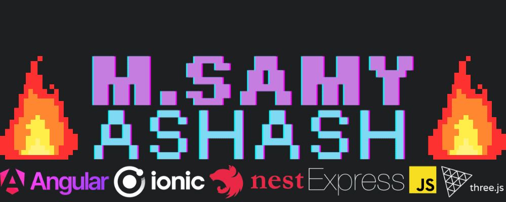

<div align="center">



<br>


<br>

[](mailto:MSamyAshAsh@hotmail.com)

</div>


## `> SYSTEM_BOOT`

```
╔══════════════════════════════════════════════════════════════════╗
║  [SYSTEM] KERNEL INITIALIZED                                     ║
║  [USER]   M.Samy AshAsh — Software Developer                     ║
║  [LOC]    EG                                                     ║
║  [STATUS] ONLINE                                                 ║
╚══════════════════════════════════════════════════════════════════╝
```

Software Developer shipping **Angular**, **Ionic**, **Vue.js**, **NestJS**, and **MongoDB** products across web, Android, and iOS. Published apps on **Google Play** and **App Store**. Delivered Angular SSR strategies driving **High organic traffic growth**. Building 3D web experiences with **Three.js** and designing AI-assisted workflows with **MCP servers** and **N8N automation**.

`B.Sc. Electrical Communication Engineering`


## `> SYSTEM_METRICS`

<div align="center">

| Metric | Value |
|:---|:---|
| 🚀 **Projects Shipped** | **20+** production launches |
| 📈 **SSR Traffic Boost** | **HIGH** organic growth |
| 📱 **Platform Reach** | Web · Android · iOS |
| 🤖 **AI Ops** | N8N · MCP Servers · AI Agents |
| 🎮 **3D / Game Dev** | Three.js · Firebase · RPG Systems |
| 🏢 **Experience** | Strong production experience across platforms |

</div>


## `> CURRENT_MISSION`

<div align="center">

| Channel | Active Payload |
|:---|:---|
| `SSR / SEO` | Angular SSR and Universal delivery focused on discoverability, indexing, and production performance |
| `Mobile Releases` | Ionic and Capacitor apps shipped to Google Play and App Store with shared codebases |
| `3D Web Systems` | Three.js gameplay, interactive scenes, Firebase sync, and analytics-rich product loops |
| `AI Automation` | MCP servers, n8n workflows, code generate/review bots, and AI-assisted delivery pipelines |

</div>

## `> TECH_LOADOUT`

<div align="center">

#### ⚔️ Frontend Arsenal


#### 🛡️ Backend & Database


#### 🎨 Styling & UI


#### 📱 Mobile & Cross-Platform


#### 🤖 Analytics & Automation


#### 🔧 DevOps & Tools


</div>


## `> DELIVERY_PROTOCOLS`

```text
[BUILD]   Angular / Vue interfaces, Ionic mobile apps, NestJS APIs
[SHIP]    Web, Android, iOS, admin dashboards, VPS-hosted systems
[MEASURE] GA4, Clarity, PostHog, Pixels, product telemetry loops
[AUTOMATE] MCP servers, n8n workflows, build pipelines, AI flows
```


## `> GITHUB_STATS`

<div align="center">


</div>

---

## `> ACTIVITY_GRAPH`

<div align="center">

[](https://github.com/ashutosh00710/github-readme-activity-graph)

</div>


## `> CONTRIBUTION_SNAKE`

<picture>
  <source media="(prefers-color-scheme: dark)" srcset="https://raw.githubusercontent.com/msamyashash/msamyashash/output/github-snake-dark.svg" />
  <source media="(prefers-color-scheme: light)" srcset="https://raw.githubusercontent.com/msamyashash/msamyashash/output/github-snake.svg" />
  
</picture>

> ⚠️ *Snake animation requires a [GitHub Action setup](https://github.com/Platane/snk) to generate it automatically.*


## `> DAILY_QUOTE`

<div align="center">

[](https://github.com/piyushsuthar/github-readme-quotes)

</div>


## `> OPEN_COMMS`

<div align="center">

[](mailto:MSamyAshAsh@hotmail.com)
[](https://github.com/msamyashash)
[](https://stackoverflow.com/users/14384334/msamyashash)

<br>

[](https://stackoverflow.com/users/14384334/msamyashash)

</div>


<div align="center">

```
╔══════════════════════════════════════════════════════════════════╗
║                                                                  ║
║   [SYSTEM] All systems operational. MACHINE ready for combat.    ║
║                                                                  ║
╚══════════════════════════════════════════════════════════════════╝
```


*Built with passion. Shipped with precision.*

</div>

