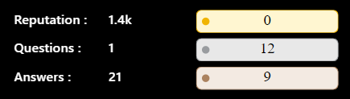

#  Inspired Yet? 

"Hey, I’m M.Samy — a full-stack developer with a killer setup and a passion for web. I chase pixels, hunt new challenges, and love sparking ideas that inspire others."

## 🔧 My Tools

## &#x270d; Today's developer quotes

## &#x1f4c8; GitHub Stats

  

 

  

## 🏆 GitHub Trophies

##  Stackoverflow stats</strong>

